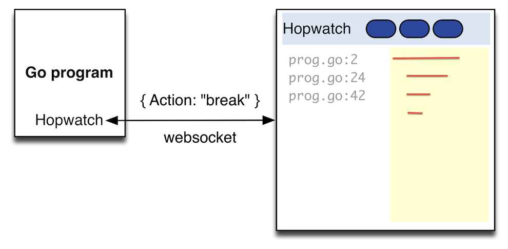

# Hopwatch, a debugging tool for Go

Hopwatch is a simple tool in HTML5 that can help debug Go programs. 
It works by communicating to a WebSockets based client in Javascript.
When your program calls the Break function, it sends debug information to the browser page and waits for user interaction.
Using the functions Display, Printf or Dump (go-spew), you can log information on the browser page.
On the hopwatch page, the developer can view debug information and choose to resume the execution of the program.

[First announcement](https://ernestmicklei.com/2012/12/hopwatch-a-debugging-tool-for-go/)

&copy; 2012-2022, http://ernestmicklei.com. MIT License 